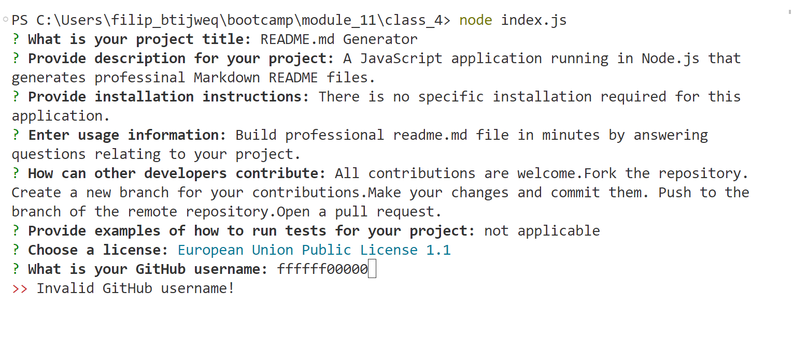
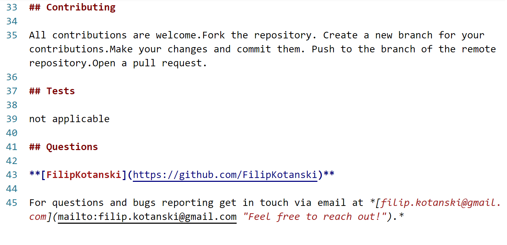

# README.md Generator 

## Description

A JavaScript application running in Node.js that generates professional Markdown

README files. 

## Table of Contents 

- [Badges](#badges)

- [Demo](#demo)

- [Installation](#installation)

- [Usage](#usage)

- [License](#license)

- [Contributing](#contributing)

- [Tests](#tests)

- [Questions](#questions)


## Badges


## Demo





## Installation

There is no specific installation required for this application.

+ In command shell or terminal navigate to the directory where you want 

to clone the repository.

```
cd /path/to/your/directory
```

+ Clone the repository.

```
git clone https://github.com/FilipKotanski/README.md-Generator.git
```

+ Initialise a new Node.js project with default values for package.json.

```
npm init -y
```

+ Install dependencies  and save them to package.json file.

```
npm install --save axios inquirer email-validator
```

+ Run index.js in Node.js server-side environment.

```
node index.js
```


## Usage

+ Build professional readme.md file in minutes by answering questions

relating to your project.

+ The readme file will save automatically in your current directory.

+ Open file in a code editor of your choice and customise to your needs.

## License

This project is licensed under the [MIT License](https://opensource.org/licenses/MIT).

## Contributing

All contributions are welcome. 

### How to Contribute

1. Fork the project.

2. Create a new branch for your contribution (`git checkout -b feature/my-feature`).

3. Make your changes and commit them (`git commit -m 'Add feature'`).

4. Push to the branch (`git push origin feature/my-feature`).

5. Open a pull request.

### Branching Strategy

- `master`: Main development branch.

- `release`: Stable releases.

- `feature/`: Feature branches.

### Pull Request Process

+ Open a pull request with a clear title and description.

+ Ensure all tests pass.

+ Await code review and address feedback if necessary.

+ Once approved, the pull request will be merged.

### Issues and Labels

+ Use the "bug" label for bug reports.

+ Use the "enhancement" label for feature requests.

## Tests

To ensure your changes don't introduce new issues, run the tests using `npm test`.
    
## Questions

[](https://twitter.com/Filip_Kotanski)

  [](https://www.linkedin.com/in/filip-kotanski-9275252a5/)

  [](https://github.com/FilipKotanski)

For questions and bugs reporting get in touch via email at [filip.kotanski@gmail.com](mailto:filip.kotanski@gmail.com "Feel free to reach out!").